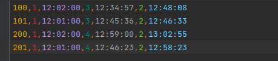

# Документация
## Описание работы с программой
При запуске программа читает данные о соревновании, дистанциях, группах и 
заявки от команд из папки, указанной в качестве параметра командной строки
(если ничего не указано, то по умолчанию название папки будет "data"). 

Далее происходит жеребьевка и программа будет ожидать, когда пользователь 
загрузит в папку data/splits *(data -- папка, которую указал пользователь 
или папка по умолчанию)* данные о прохождении дистанций и сообщит название файла 
через консольный ввод. 

После этого в папке data/results появятся протоколы результатов.

## Формат входных данных
Все файлы имеют формат .csv Запятые в данных можно писать только 
внутри двойных кавычек (например "ПСКОВ,РУСЬ", но ПСКОВ,РУСЬ считается как два
столбца). В таком случае все поле должно быть в кавычках 
(,что-то "ПСКОВ,РУСЬ" писать нельзя).

Примеры данных можно посмотреть в папке test-data (три небольших сета с данными).

### Данные о соревновании
Хранятся в директории data/config в виде трёх файлов

#### event.csv
Общие данные о соревновании. Столбцы "Название" и "Дата".

#### classes.csv
Соответствия между группами и дистанциями. Столбцы "Название" - название группы 
и "Дистанция" - дистанция, которую проходят участники данной группы.

#### courses.csv
Данные о дистанции. В первом столбце название дистанции, далее идет произвольное
количество контрольных пунктов (КП). Первый КП считается стартовым, то есть 
время отсчитывается с момента, когда участник проходит первый КП.

### Заявочные списки
Хранятся в data/applications. Названия файлов могут быть любыми. В первой
строке указано название команды. В следующей строке названия столбцов: "Группа",
"Фамилия", "Имя", "Г.р." (год рождения), "Разр." (разряд, можно не указывать).
Например:

### Стартовые протоколы
Хранятся в data/start protocols. Для каждой группы свой файл. Участники 
распределяются случайно.

### Сплиты
Хранится в data/splits. В первом столбце указывается номер участника,
далее информация о прохождении дистанции в формате "название КП, время в формате 
hh:mm:ss".
Например:

### Протоколы результатов
Хранятся в data/results в двух файлах, results.csv для участников и 
teamResults.csv для команд. Участники не прошедшие дистанцию (прошли не все
КП, слишком много КП, не в том порядке) указываются в конце таблицы. Результат
считается как разность между временем прохождения последнего и первого КП. 
Очки для команды вычисляются по формуле:

>max(0, 100 * (2 - <результат>/<результат победителя>)).

## Логи
Логи можно посмотреть в папке loggers. Обычный лог в logger.txt Ошибки и 
проблемы с данными пишутся в errors_and_warnings.txt